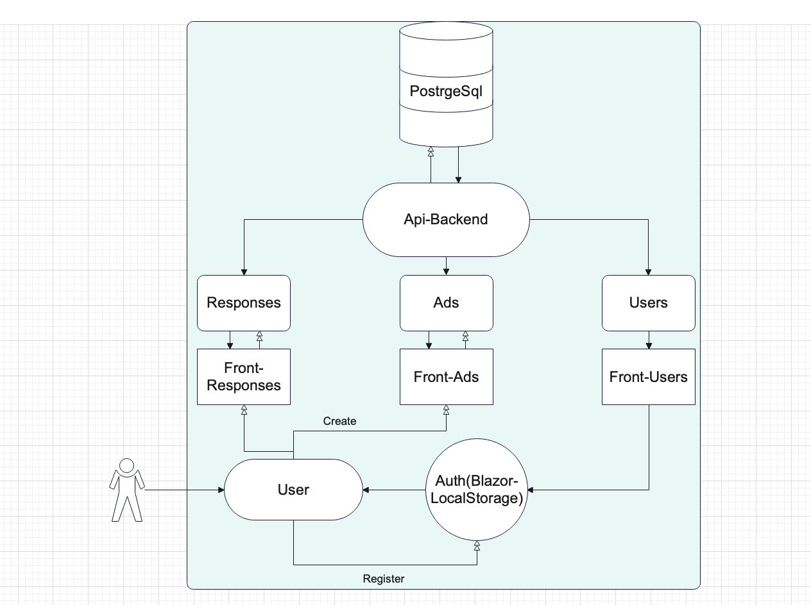

# Веб-сервис UniHelper по размещению объявлений

## Описание проекта

Этот проект представляет собой веб-сервис по размещению объявлений, разработанный с использованием ASP.NET Core. Сервис позволяет пользователям публиковать объявления, просматривать доступные объявления и откликаться на них.

## Архитектура

Проект построен на многослойной (Layered Architecture) архитектуре и включает в себя следующие слои:

### 1. Слой представления (Presentation Layer)
- Реализован через контроллеры ASP.NET Core: UsersController, AdsController, ResponsesController.
- Обрабатывает HTTP-запросы (GET, POST, DELETE и т. д.) и возвращает ответы в формате JSON.
- Использует атрибуты маршрутизации ([Route], [HttpGet], [HttpPost]) для RESTful API.

### 2. Слой бизнес-логики (Business Logic Layer)
- Реализует валидацию входных данных и бизнес-правила.
- Часть логики выполняется в контроллерах (например, проверка уникальности email при регистрации).
- Часть логики находится в репозиториях (AdRepository, ResponseRepository).

### 3. Слой доступа к данным (Data Access Layer)
- Реализован с использованием Entity Framework Core.
- Обеспечивает работу с базой данных PostgreSQL.
- Используется паттерн Repository (AdRepository, ResponseRepository) для абстрагирования работы с БД.

## RESTful API

Проект реализует REST API с поддержкой следующих маршрутов:

### Пользователи (/api/users)
- POST /api/users/register — регистрация пользователя.
- POST /api/users/login — вход в систему.

### Объявления (/api/ads)
- GET /api/ads — получение списка всех объявлений.
- POST /api/ads — создание нового объявления.
- DELETE /api/ads/{id} — удаление объявления по ID.

### Отклики (/api/responses)
- POST /api/responses — отклик на объявление.

## Используемые технологии
- Язык программирования: C#
- Фреймворк: ASP.NET Core + Blazor WebAssembly
- База данных: PostgreSQL
- ORM: Entity Framework Core
- Аутентификация: Blazor Local Storage



## Запуск проекта

### Запуск через Docker
1. Установите [Docker](https://www.docker.com/).
2. Запустите команду:
   ```bash
    docker-compose up -d
   
### Локальный запуск
1. Установите .NET SDK.
2. Настройте подключение к PostgreSQL в appsettings.json.
3. Запустите миграции базы данных:
   
   dotnet ef database update   
4. Запустите приложение:
   ```bash
   dotnet run
   


### 4. Функциональные требования

1. **Регистрация и аутентификация пользователей**
   - Пользователь может зарегистрироваться, указав уникальный email и пароль.
   - Пользователь может войти в систему, используя свои учетные данные (email и пароль).


2. **Управление объявлениями**
   - Аутентифицированный пользователь может создать объявление, указав заголовок, описание.
   - Любой пользователь (аутентифицированный или нет) может просматривать список всех доступных объявлений.
   - Аутентифицированный пользователь может удалить только свои объявления по их уникальному идентификатору (ID).
   - Объявления должны содержать дату создания и отображаться в порядке от новых к старым.

3. **Отклики на объявления**
   - Аутентифицированный пользователь может оставить отклик на любое объявление.
   - Отклик должен содержать текст сообщения и ссылаться на конкретное объявление.
   - Автор объявления должен иметь возможность видеть все отклики на свои объявления.

4. **Валидация данных**
   - При регистрации email должен быть валидным и уникальным.
   - Описание объявления без ограничения количества символов.
   
## Разработчики
- Пантелеев Кирилл Максимович (Docker, Readme, PostgreSQL)
- Курюкин Егор Сергеевич (TeamLead, Frontend, Architector)
- Исаков Глеб Аюбович (Backend, PostgreSQL)
